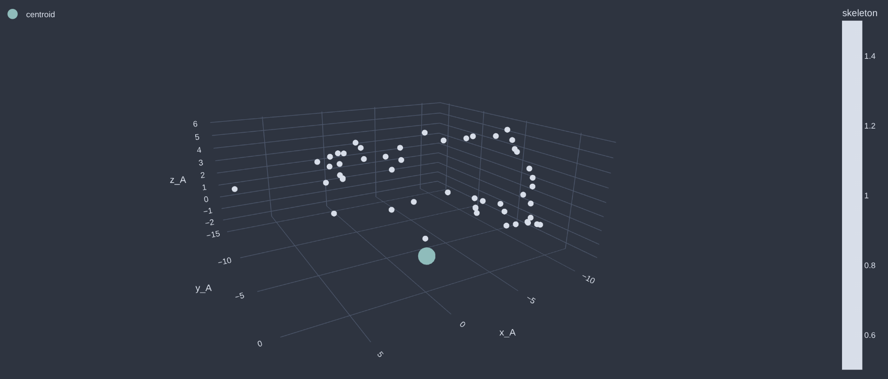
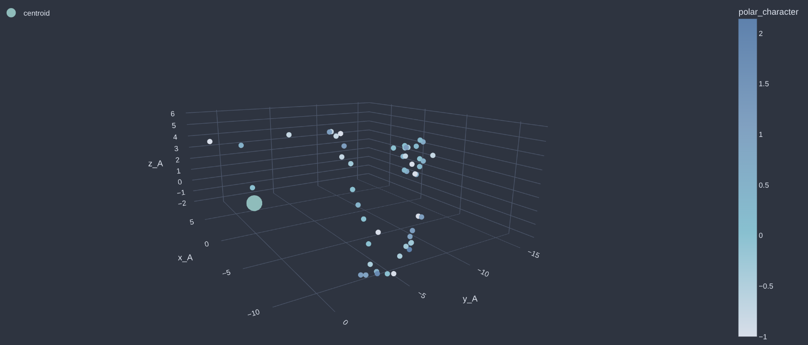
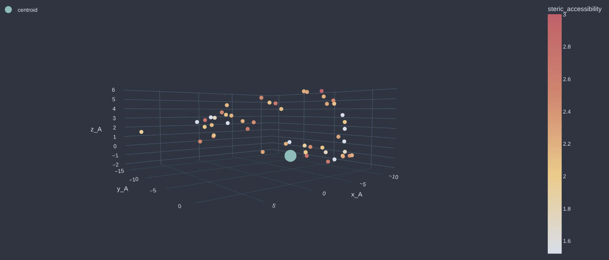
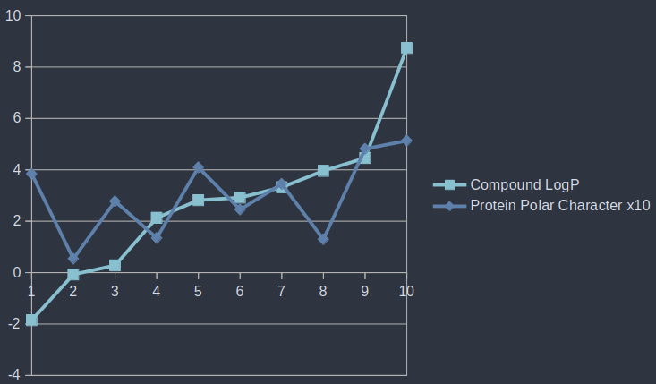

# NanoMaker
*NanoMaker takes a drug molecule as input and designs a high-affinity protein binding pocket / surface patch around its geometric center using both spatial and biochemical data.*

---

A personal research prototype, NanoMaker is a dual cross-attention transformer system that generates a 3D arrangement of amino acid (AA) residues' alpha carbons 
that would form a high-affinity binding area to any given chemical's scaffold in SMILES format. 
These can then be used as protein binding pocket templates for drug-delivery molecules. NanoMaker also comes with a visualization 
and characterization module, allowing for downstream analyses.

NanoMaker separates the challenge of de novo protein design into two cross-attention transformer tasks. 
Model 1, **Skeleton**, creates the 3D spatial arrangement / skeleton of the upcoming protein pocket, 
while model 2, **NAAnoBot**, slots amino acids (AAs) into the empty coordinates based on biochemical and spatial compatibility.
Both transformers are cross-attention models conditioned on drug structure, 
meaning that each protein pocket is specific to the given drug's properties.

I've drawn out a conceptual example skeleton and its populated final form, you can see what they look like in practice further down:

|        Figure 1: 3D arrangement / "skeleton"         |       Figure 2: Full NanoMaker-generated pocket        |
|:----------------------------------------------------:|:------------------------------------------------------:|
|  |  |

On the left we see a system of linked empty nodes representing AA slots forming a pocket around the ligand centroid (drug geometric center).
In the drawing on the right I've filled in those nodes with amino acid identities, completing the protein binding pocket.

Notes: 
- "Ligand" and "drug" will be used interchangeably. A ligand is just something that binds. In this case it's a chemical structure.
- Scaffold: core structure of a given drug
- Analog(ue): variation of a scaffold


---

## NanoMaking
Installation + start virtual environment
```
git clone https://github.com/Elliot-Chan-120/NanoMaker.git
cd NanoMaker
python3 -m venv .venv
```

Activate virtual environment
```
source .venv/bin/activate  <- Linux and Mac
source .venv/Scripts/activate  <- Windows
```

Install requirements
```
pip install -r requirements.txt
```

I've created a separate repo where you can download the model weights:
https://huggingface.co/ElliotChan120/NanoMakers

Or you can copy the database files and prototyping notebooks into a cloud server like colab or lightningai (i prefer that one) 
to train with your own parameters.
I used a T4 GPU on LightningAI, but if you have a good nvidia gpu and can afford a few days that's fine too. 
It took me over 48 hours to train both models.

Once you have the model weights, move them here, where the config.py file lives: ```src/nano_maker/container```.

### Test run for aspirin:
NanoMaker is runnable through both JupyterLab and the CLI, whose commands are covered below. 
I've also included a "nanomaker_use.ipynb" file that guides the user through a typical run. 
This section covers what a typical run should resemble when executing all cells in the guide file or all cli commands:

Aspirin's chemical smiles is: "CC(=O)OC1=CC=CC=C1C(=O)O".

First, NanoMaker will produce a ".nanopkt" file in this specific format that downstream modules can parse, visualize and characterize.

The cli command for this is 
```
(from root)
python3 nnmkr.py generate "CC(=O)OC1=CC=CC=C1C(=O)O" aspirin --temp 0.3
                          # smiles needs parentheses         # sampling_temperature: 
                                                               - how "strict" the amino acid choices are
                                                               - 0.3 by default
                                                               - lower = stricter and vice versa
```

```
>_0.3_ms7e84_c1ccccc1
Target>_CC(=O)OC1=CC=CC=C1C(=O)O

>__nnpkt
E	[0.173, -15.92, -0.0297]
E	[8.2984, -12.871, 1.6654]
H	[-2.1276, -14.4948, 3.5951]
C	[0.2286, -14.481, 2.6729]
S	[0.3466, -14.3896, 1.8595]

... I've pruned the data to save space

I	[0.1374, 0.021, 1.1619]
```

The analysis module allows for various types of visualization depending on each amino acid's properties.
Here I have visualized the pocket by each amino acid's [1] raw skeleton, [2] polar_character, and [3] steric_accessibility (size and exposed surface vol.).
The other options are: amino acid identity, hydrophobicity, and flexibility.
The visualizations are done via plotly express, so in the notebook or window you can drag, zoom, and hover over each 
node to see its identity and analysis values.

cli command:
```
python3 nnmkr.py visualize aspirin [insert visualization mode here] --save <- if you want to save it as html, leave blank if not needed
```

| Visualization type   | Image                                                        |
|----------------------|--------------------------------------------------------------| 
| skeleton             |          |
| polar_character      |        |
| steric_accessibility |  |

NanoMaker's pocket analysis module allows for quantitative analysis of the binding pockets produced, as visual analysis might not be concrete enough.
I've also included a "note-taking" function that records any notable standout features the binding pocket produced may exhibit.

cli command:
```
python3 nnmkr.py report aspirin --save
```

```
BINDING POCKET REPORT
==================================================
Sampling temperature: 0.3
Amino acid sequence:EEHCSRLRCGAISCVDTKKLAIIIGTNAQSHYKCANSPQVGQIIAGFDEHI
==================================================

Section 1: Biochemical Property Summary
|-- average_polar_character: 0.209
|-- polar_character_deviation_pct: 13.396
|-- average_hydrophobicity: 0.202

....

Section 2: Geometric Analysis
|-- X range: 19.767
|-- Y range: 17.981
|-- Z range: 8.065

==================================================

Notable Binding Pocket Characteristics:
- slightly polar character, slightly hydrophilic, chamber-style binding pocket
```
Note that aspirin does have polar and hydrophilic character so the characteristics line up nice. See "Performance and Model Behaviour" for a more complete picture of how these models behave during generation.

With that we've successfully generated, visualized and analyzed a protein binding pocket for Aspirin!
I've included a separate test run for vitamin C in the source files.

---

## (Inverse) Radial Sequencing
I imagined the space around an arbitary drug centroid as a series of spherical shells, with each sequential shell's radius increasing. 
Think of a glass ball within a glass ball many times over, with the outermost glass ball being the largest and vice versa.
I've characterized 3D protein binding pockets as "radial" sequences of AA identities and their spherical coordinates ordered by decreasing shell radius. 
The fineness of the ordering is determined by a "radial_resolution" parameter (default 100, so 100 shells or glass balls). 
I've attempted to draw and visualize my conceptualization of this here:

|   Protein pocket to "radial_sequence" visualization    |
|:------------------------------------------------------:|
|  |


Resulting "radial sequences" are presented as such during training with the goal of autoregressively predicting the next set of vectors.
```
[[[AA identity 1], [rad1, az1, pl1]], [[AA identity 2], [rad2, az2, pl2]] .... [[VOID], [0, 0, 0]]]
              # radius, azimuth, polar                                            # end "token"
```
Coordinates consist of radius value in angstroms, azimuth and polar angles computed from relative XYZ values. 

The choice to go outward -> inward was deliberate as I wanted the resulting transformers to have as much information
as possible before placing amino acids within the closest proximity to the ligand, as intuitively these should be the
most important AAs to stabilize / bind.

**Sequencing Concept Logic:**
Imagine an observer object exploring the entire protein pocket space shell by shell, recording each subsequent amino 
acid's (decreasing) radius to the ligand centroid until the last amino acid's data is recorded.
The very end of each sequence is padded with a "VOID" identity and a spherical coordinate of zeros, which conceptually 
is the "end" of the sequence as that's where the drug centroid is and a protein absolutely cannot exist there.
Since protein pocket generation is out --> in, I interpreted hitting a radius of 0 and under as the equivalent to encountering an "END" token in Natural Language Processing.


Each amino acid identity is then mapped to its hand-curated unique biochemical feature vector downstream.
These biochemical feature vectors are my attempt to represent amino acids by their physical and bio/chemical properties like isoelectric points, aromatic ring presence or hydrophobicity.

---

## Skeleton: 3D structure generation
Model: Skeleton is responsible for generating the 3D spatial arrangement of the protein pocket
prior to amino acid insertion into said pocket, hence the name "Skeleton". 

When presented with a chemical compound, it will say: "the protein pocket surrounding this 
molecule should look like this". It then generates a series of spherical coordinate vectors, with each
corresponding to a "blank" amino acid's alpha carbon placement relative to the drug compound's centroid (Figure 1).

note: alpha carbon = main carbon of amino acid

e.g.
```
alpha carbon 1: [14.13, -1.043, 1.56]
alpha carbon 2: [14.00, -1.95, 1.40]
alpha carbon 3: [13.8, -2.44, 1.53]
...
alpha carbon n+1: [radius =< threshold, azimuth, polar] <-- cutoff coordinate (radius below threshold)
```

These will then be translated back into finalized xyz coordinates.
```
alpha carbon 1: [-6.734169765180114, 14.448926127937195, 2.925794734487335],
alpha carbon 2: [-4.016766858354317, 14.904996348343234, 1.74489712118305],
alpha carbon 3: [-11.065344000905538, 9.318996844158944, 2.551681796821662],
...
alpha carbon n: [13.383470121049884, 4.287071199307037, -0.5404584759555853],
```

---

## NAAnoBot: Biochemical Environment Curation
Model: NAAnoBot is responsible for deciding which amino acid belongs in a given coordinate.

Each AA is characterized by their physicochemical properties and (bio)chemical makeup that 
distinguish them from the rest. 
NAAnoBot works with spatially aware "tokens", meaning it actually doesn't interpret sequences via 
amino acid identities (like "A", "H", "C" .etc) but rather their feature vectors and relative geometries. 
Its selection of the next AA depends on the neighbouring
AAs biochemistry *and* their spatial positioning relative to the target coordinate.

(In human terms...)
NAAnoBot doesn't say "Valine" or "Leucine" belongs here, instead it says:

"I see all these AAs around target coordinate 'x', and because of their biochemical features and geometry relative to 'x', an amino acid with *these* biochemical properties would fit in there".

Once the biochemical feature vector is produced, it is then matched against all amino acid feature vectors to determine its best fit.
It does this continuously for each provided coordinate until the protein pocket is completed.

For more information on the how each amino acid is characterized biochemically, the source file "naanolibrary.py" 
in src/nano_maker/modules/nAAno contains the sources + citations and some comments further clarifying the feature engineering scheme.

---

## Data + Training
Data is resolved protein-drug complexes from BindingDB and PDB with binding affinities of 0.1nM (extremely high affinity).
Skeleton's loss was defined as a composite across MSE of radius and unit circle angle difference, with weighted emphasis on angular orientation. 
NAAnoBot's loss is MSE between predicted feature vectors and the target AA's feature vector (nAAno_token!).
The data split was done according to drug scaffold identity rather than a random split after combinatorial explosion of drug vs. sequence windows. 

Total SMILES were split 80% into training and 20% into validation prior to sequence window extraction.
Training split comprised of 5 million training sequence windows. Validation set was comprised solely of molecule scaffolds non-existent in training data, 
meaning that the models' performance relies on whether they learnt actual relationships b/w 3D arrangement, biochemistry and drug structure rather than memorization.

See Disclaimer at the bottom regarding novel chemistry generalization ability and justification for using scaffolds instead of absolute drug analogues.

---

## Loss Metrics
Skeleton and NAAnoBot went through the same train / validation drug scaffold identity split.
Training loss was computed as a running average over all batches, hence why the initial epoch gaps are large.

**Skeleton Loss**: 
```
0.1 * radial loss + 0.45 * azimuth loss + 0.45 * polar loss
```

| Epoch   | Train (3sf) | Validation (3sf) | Gap (3sf) |
|---------|-------------|------------------|-----------|
| Initial | 11.380      | n/a              | n/a       |
| 1       | 0.912       | 0.762            | -0.150    |
| 2       | 0.780       | 0.620            | -0.160    |
| 3       | 0.646       | 0.482            | -0.165    |
| 4       | 0.523       | 0.370            | -0.153    |
| 5       | 0.443       | 0.317            | -0.126    |

note: I do intend to train skeleton for 8 epochs total eventually, 
but I ran out of hours on lightningai and I already spent 50 bucks on extra credits.
Regardless, it's become apparent that Loss matters less than output sanity when it comes to 
evaluating how "good" each of these models is.

**NAAnoBot Loss**: 
```
0.8 * Cross Entropy b/w predicted vectors and AA vectors + 0.2 * vector similarity loss
```

| Epoch   | Train (3sf) | Validation (3sf) | Gap (3sf) |
|---------|-------------|------------------|-----------|
| Initial | 2.874       | n/a              | n/a       |
| 1       | 1.438       | 1.156            | -0.28     |
| 2       | 1.162       | 1.109            | -0.0537   |
| 3       | 1.131       | 1.0986           | -0.0326   |
| 4       | 1.120       | 1.0946           | -0.0249   |
| 5       | 1.114       | 1.0937           | -0.0205   |


TODO: 
- Loss Curves

---

## Performance and Model Behaviour Observations
Since truly examining NAAnoBot's biochemical reasoning ability would require extensive analyses, 
I decided to plot average protein pocket polar character over 10 generated pockets vs. 10 drug logP (hydrophobicity / polarity inferred) 
values as a proxy for its potential biochemical reasoning ability. Sampling temperature was set to 0.01 (basically argmax) for maximum strictness and no variation. 
Pockets produced were definitely not natural but were representative of NAAnoBot's behaviour.
Polar character is an aggregate across net charge, hydrophobicity, # of H donors and H acceptors.

This is a preliminary test and should not be interpreted as validation of binding-pocket realism.

| Compound Name | LogP  | Protein Pocket Polar_character x10 (readability) |
|---------------|-------|--------------------------------------------------|
| methotrexate  | -1.85 | 3.8410                                           |
| caffeine      | -0.07 | 0.5391                                           |
| ciproflaxin   | 0.28  | 2.7745                                           |
| benzene       | 2.13  | 1.3470                                           |
| diazepam      | 2.82  | 4.0941                                           |
| cyclosporin A | 2.92  | 2.4520                                           |
| testosterone  | 3.32  | 3.4497                                           |
| paclitaxel    | 3.96  | 1.2955                                           |
| atorvastatin  | 4.46  | 4.8161                                           |
| cholesterol   | 8.74  | 5.1344                                           |

| Benchmark Graph: Compound LogP vs Protein Polar Character * 10 |
|----------------------------------------------------------------| 
|      |                                                          |

Visual observations show that there is a moderate positive correlation between the increase in LogP of a given compound's SMILES and NAAnoBot's amino acid choices on average.
There are a few spikes that appear out of place, which are most likely due to some of the chemical compounds' scaffolds being widely different from their original identity.
This is consistent with the disclaimer mentioned below that molecules whose R groups contribute heavily to binding dynamics are not reliable and should be treated as scaffold-level
blueprints rather than actual protein pocket templates (none of NanoMaker's outputs should be anyway but you get the point). 
Furthermore, other small drugs that were planning on being tested like urea had empty scaffolds where the scaffold would literally be "". 
So its impossible to tell how well NAAnoBot would generalize to such molecules who literally don't have scaffolds. 

Observationally, it appears there is a link between Skeleton's choices in protein cage design and molecule size. 
Throughout the process of making NanoMaker, I noticed that dominant pocket styles for larger SMILES (more characters) 
and generally, larger scaffolds, were "chambers" (think of a cupped hand). For smaller molecules, surface-like patches and vice-shaped pockets were more common.
All pockets synthesized stuck to one hemisphere of the centroid, whether or not this reflects the actual biochemistry is out of my depth...

Overall, this project demonstrates that the architecture can generate structurally varied protein binding pockets whose 
aggregated biochemical properties appear to vary with the ligand scaffold's features. Further validation would be needed
to confirm if amino acid selection patterns are truly biochemically reasoned within NAAnoBot, as of right now it remains an open question.

---

## Disclaimer + Limitations, Notes on Using Scaffolds and Pathogenic Resemblance
**NanoMaker is purely an independent research prototype**, built for learning and exploration.
Generated protein pockets do not account for orientation of both the ligand or the amino acids themselves in 3D space.
The architecture, training pipeline and data representations are not validated against established benchmarks in structural biology or computational drug discovery.
Generated pockets should not be used to inform any protein design, clinical or therapeutic decisions.

#### True zero-shot capability on novel chemistry would require further validation

<br>

**Using Scaffolds instead of Absolute Drug Identity**

The original prototype of NanoMaker separated train-test data by absolute drug identity rather than the scaffold identity.
The problem is, for drug-protein pairs with high-affinity binding of 0.1nM, many chemical compounds were highly similar analogs.
This led to many compounds with the same scaffold but with 10-80+ analogues within each train-test split, introducing a
high degree of data homogeneity and a slight possibility of minimal data leakage (1 cluster of drug analogs split across the train / test).

NanoMaker was essentially being trained, then tested on chemically homogenous data. Which is not optimal at all for 
zero-shot capability on novel chemistry, one of the main goals of this project.

All chemical compounds were then split by their scaffolds, removing analogs and looking at their core chemistry and structure instead. 
Chemically similar scaffolds still persisted but the 50% reduction achieved by this splitting style is a clear 
indicator of analogue redundancy being addressed. Any data leakage from this was likely minimal given the reduced size
of potential clusters, but validation metrics should still be considered slightly optimistic.

Furthermore, splitting by scaffold means that during inference, molecules whose R groups contribute greatly to 
binding dynamics are not well-generalized, and binding pockets generated for these "R group-dependent" molecules 
should be treated as scaffold-level rather than R-group-specific generations. 

A chemical similarity metric (Tanimoto similarity) is provided at inference to indicate how well-represented the 
input chemical's scaffold is in the training data.

<br>

**Note on Pathogenic Resemblance**

There may also exist the possibility that the pockets generated might resemble certain pathogenic molecules since that's what the training data comprised of.
However, I should note that there is a distinction between:
- Pathogenic active / binding sites: exist within a pathogen + performs harmful function, comprised of more complex structures
- NanoMaker-generated pockets: 3D-designed binding pocket with the sole purpose of high binding affinity

---

## License
Copyright (c) 2026 Elliot Chan 

This project is licensed under the [GNU Affero General Public License v3.0](https://www.gnu.org/licenses/agpl-3.0.en.html).
See the [LICENSE](LICENSE) file for details.