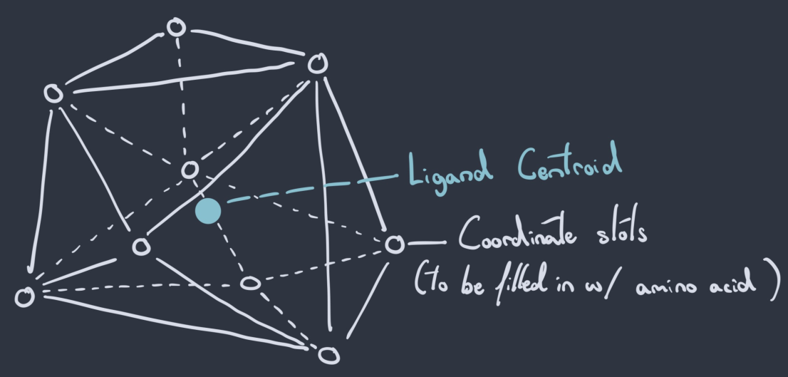
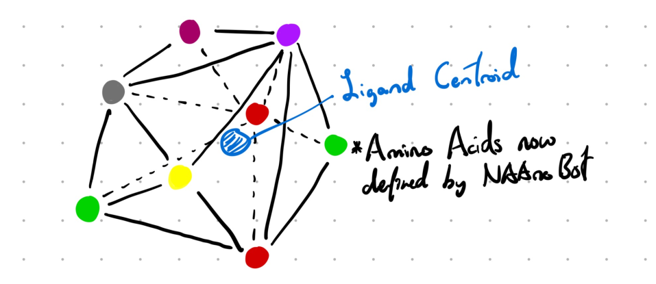
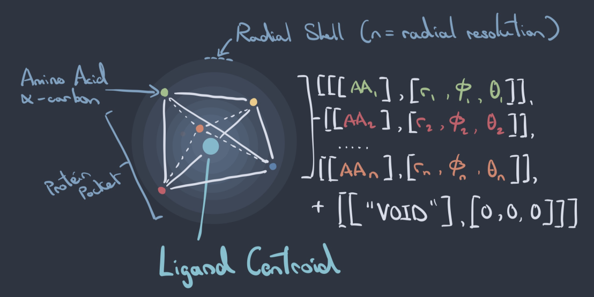

# NanoMaker

---
A dual cross-attention transformer system that generates a 3D cage of amino acid residues' alpha carbons 
that would form a high-affinity binding pocket to any given chemical in SMILES format. 
These can then be used as protein pocket patch templates for drug-delivery molecules.

NanoMaker separates the challenge of protein pocket design into two transformer tasks. 
Model 1, "Skeleton", creates the 3D spatial arrangement / skeleton of the upcoming protein cage, 
while model 2, "NAAnoBot", slots amino acids into the empty coordinates based on biochemical compatibility.
Both transformers are cross-attention models conditioned on drug structure, 
meaning that each protein cage is specific to that drug's properties.

I've drawn out an example skeleton and its populated final form:

|        Figure 1: 3D arrangement / "skeleton"         |       Figure 2: Full NanoMaker-generated pocket        |
|:----------------------------------------------------:|:------------------------------------------------------:|
|  |  |

On the left we see a system of linked empty nodes representing amino acid slots forming a cage around the ligand centroid (geometric center).
In the drawing on the right I've filled in those nodes with amino acid identities, completing the protein binding pocket.

Note: "Ligand" and "drug" will be used interchangeably. A ligand is just something that binds. In this case it's a chemical structure.

---

## (Inverse) Radial Sequencing
I imagined the space around an arbitary drug centroid as a series of spherical shells, with each sequential shell's radius increasing. 
Think of a glass ball within a glass ball many times over, with the outermost glass ball being the largest and vice versa.
I've characterized 3D protein binding pockets as "radial" sequences of AA identities and their spherical coordinates ordered by decreasing shell radius. 
The fineness of the ordering is determined by a "radial_resolution" parameter (default 100, so 100 shells or glass balls). 
I've attempted to draw and visualize my conceptualization of this here:

|   Protein pocket to "radial_sequence" visualization    |
|:------------------------------------------------------:|
|  |


Resulting "radial sequences" are presented as such during training with the goal of autoregressively predicting the next set of vectors.
```
[[[AA identity 1], [rad1, az1, pl1]], [[AA identity 2], [rad2, az2, pl2]] .... [[VOID], [0, 0, 0]]]
              # radius, azimuth, polar                                            # end "token"
```
Coordinates consist of radius value in angstroms, azimuth and polar angles computed from relative XYZ values. 

The choice to go outward -> inward was deliberate as I wanted the resulting transformers to have as much information
as possible before placing amino acids within the closest proximity to the ligand.

**Sequencing Concept Logic:**
Imagine an observer object exploring the entire protein pocket space shell by shell, recording each subsequent amino 
acid's (decreasing) radius to the ligand centroid until the last amino acid's data is recorded.
The very end of each sequence is padded with a "VOID" identity and a spherical coordinate of zeros, which conceptually 
is the "end" of the sequence as that's where the ligand centroid is and a protein absolutely cannot exist there.

Each amino acid identity is then mapped to its hand-curated unique biochemical feature vector downstream.
Since protein cage generation is out --> in, I interpreted hitting a radius of 0 and under as the equivalent to encountering an "END" token in Natural Language Processing.

---

## Data + Training
Data is resolved protein-drug complexes from BindingDB and PDB, with loss defined as a composite across MSE of radius and unit circle angle difference for Skeleton. NAAnoBot's loss is MSE between feature vectors.
The data split was done according to drug identity rather than a random split after combinatorial explosion of drug vs. sequence windows.
Total SMILES were split 80% into training and 20% into validation prior to sequence window extraction.
Training split comprised of 14 million training sequence windows. Validation set was comprised solely of molecules non-existent in training data, 
meaning that the models learn actual relationships b/w 3D arrangement, biochemistry and drug structure rather than memorization.
---

## Model Performance and Loss
Each model went through 3 epochs across the same train / validation drug identity split.
Training loss was computed as a running average over all batches, hence why the initial epoch gaps are large.

**Skeleton**

| Epoch   | Train (3sf) | Validation (3sf) | Gap (2sf) |
|---------|-------------|------------------|-----------|
| Initial | 44.884      | n/a              | n/a       |
| 1       | 0.618       | 0.388            | -0.23     |
| 2       | 0.398       | 0.262            | -0.14     |
| 3       | 0.285       | 0.232            | -0.053    |


**NAAnoBot**

| Epoch   | Train (3sf) | Validation (3sf) | Gap (2sf) |
|---------|-------------|------------------|-----------|
| Initial | 0.691       | n/a              | n/a       |
| 1       | 0.          | 0.               | -0.       |
| 2       | 0.          | 0.               | -0.       |
| 3       | 0.          | 0.               |           |

---

## Skeleton: 3D structure generation
Model: Skeleton is responsible for generating the 3D spatial arrangement of the protein pocket
prior to amino acid insertion into said pocket, hence the name "Skeleton". 

When presented with a chemical compound, it will say: "the protein cage surrounding this 
molecule should look like this". It then generates a series of spherical coordinate vectors, with each
corresponding to a "blank" amino acid's alpha carbon's placement relative to the chemical compound's centroid (Figure 1).

note: alpha carbon = main carbon of amino acid

e.g.
```
alpha carbon 1: [14.13, -1.043, 1.56]
alpha carbon 2: [14.00, -1.95, 1.40]
alpha carbon 3: [13.8, -2.44, 1.53]
...
alpha carbon n+1: [radius =< threshold, azimuth, polar] <-- cutoff coordinate (radius below threshold)
```

These will then be translated back finalized xyz coordinates.
```
alpha carbon 1: [-6.734169765180114, 14.448926127937195, 2.925794734487335],
alpha carbon 2: [-4.016766858354317, 14.904996348343234, 1.74489712118305],
alpha carbon 3: [-11.065344000905538, 9.318996844158944, 2.551681796821662],
...
alpha carbon n: [13.383470121049884, 4.287071199307037, -0.5404584759555853],
```

---

## NAAnoBot: Biochemical Environment Curation
Model: NAAnoBot is responsible for deciding which amino acid belongs in a given coordinate.

NAAnoBot works with spatially aware "tokens", meaning it actually doesn't interpret sequences via 
amino acid identities but rather their feature vectors + relative coordinates to the target coordinate.
Each aa is characterized by their physicochemical properties and chemical structure(s) / functional group(s) that 
distinguish them from the rest. 

NAAnoBot doesn't say "Valine" or "Leucine" belongs here, instead it says 
"I see all these proteins around coordinate 'x', and because of their biochemical features and geometry relative to 'x', an amino acid with "*Y* biochemical properties" would fit in there".
Once the biochemical feature vector is produced, it is then matched against all amino acid feature vectors to determine its best fit.
It does this continuously for each provided coordinate until the protein pocket is completed.

---


## todo: Generalization to Unseen Chemistry (after conducting tests on datasets)
As stated previously in the data section, the validation data split consisted not of 20-30% of XY data points, but rather
unseen SMILES (20% of total SMILES) that would then produce said XY data points. This was done to "encourage" potential zero-shot capabilities
for new molecules.

---

## Disclaimer + Note on Pathogenic Resemblance
This project is an independent research prototype, built for learning and exploration.
Generated protein pockets do not account for orientation of both the ligand or the amino acids themselves in 3D space.
The architecture, training pipeline and data representations are not validated against established benchmarks in structural biology or computational drug discovery.
Generated pockets should not be used to inform any protein design, clinical or therapeutic decisions.

There may also exist the possibility that the pockets generated might resemble certain pathogenic molecules since that's what the training data comprised of.
However, I should note that there is a distinction between:
- Pathogenic active / binding sites: exist within a pathogen + performs harmful function, comprised of more complex structures
- NanoMaker-generated pockets: 3D-designed pocket with the sole purpose of high binding affinity

---

## License
Copyright (c) 2026 Elliot Chan 

This project is licensed under the [GNU Affero General Public License v3.0](https://www.gnu.org/licenses/agpl-3.0.en.html).
See the [LICENSE](LICENSE) file for details.